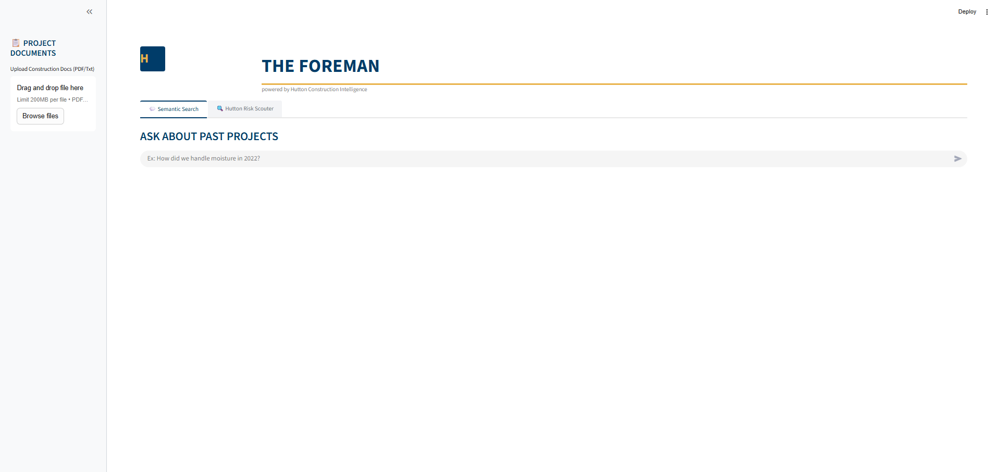

# The Foreman - Hutton Construction Intelligence

**The Foreman** is an internal RAG (Retrieval-Augmented Generation) application designed for **Hutton Construction**. It empowers project managers to query historical construction documents using natural language and assess risks for new projects based on past data.

 


## 🚀 Key Features

*   **Natural Language Search**: Ask questions like *"How did we handle moisture in the 2023 Cold Storage project?"* and get answers synthesized from your PDF archives.
*   **Hutton Risk Scouter**: A specialized AI agent that analyzes new project descriptions against historical "lessons learned" to flag potential design or budget risks.
*   **Document Ingestion**: Drag-and-drop interface to upload and index PDF/Text construction documents (contracts, daily logs, closeout reports).
*   **Tiered AI Intelligence**:
    *   **Gemini 3 Flash** for fast, efficient semantic search.
    *   **Gemini 3 Pro** for deep reasoning and complex risk analysis.

## 🛠️ Tech Stack

*   **Frontend**: Streamlit (Python) - Industrial-Modern UI
*   **Backend**: FastAPI (Python)
*   **Orchestration**: LlamaIndex (RAG Framework)
*   **Database**: Supabase (PostgreSQL + pgvector)
*   **LLMs**: Google Gemini 3 Flash & Pro
*   **Embeddings**: Gemini `text-embedding-004`

## ⚙️ Setup & Installation

### 1. Prerequisites
*   Python 3.10+
*   A Supabase Project (with `vector` extension enabled)
*   Google AI Studio API Key

### 2. Installation
Clone the repository:
```bash
git clone https://github.com/Basil-Dunford/The-Foreman.git
cd The-Foreman
```

Create a virtual environment and install dependencies:
```bash
python -m venv venv
# Windows
.\venv\Scripts\activate
# Mac/Linux
source venv/bin/activate

pip install -r requirements.txt
```

### 3. Environment Configuration
Create a `.env` file in the root directory:
```ini
SUPABASE_URL="your-supabase-url"
SUPABASE_KEY="your-supabase-service-role-key"
GOOGLE_API_KEY="your-google-gemini-api-key"
```

### 4. Database Setup
Run the SQL script in your Supabase SQL Editor (`database_setup.sql`) to create the necessary tables and functions:
```sql
-- Enable pgvector
create extension if not exists vector;

-- Create documents table
create table if not exists documents (
  id uuid primary key,
  content text,
  metadata jsonb,
  embedding vector(768)
);

-- Create match function (RPC)
-- (See database_setup.sql for full function definition)
```

## 🏃‍♂️ Usage

**Run the Application:**
We included a handy batch script for Windows:
```bash
.\run_app.bat
```
*Alternatively, run backend and frontend manually:*
```bash
uvicorn backend.main:app --reload --port 8000
streamlit run frontend/app.py
```

### Workflow
1.  **Ingest**: Go to the sidebar, upload a PDF (e.g., a "Lessons Learned" doc), and click "Ingest".
2.  **Search**: Use the "Semantic Search" tab to ask specific questions about the uploaded content.
3.  **Risk Analysis**: navigate to "Hutton Risk Scouter", paste a new project brief, and let the AI identify potential risks based on historical data.

## 📄 License
Internal Tool - Hutton Construction.
